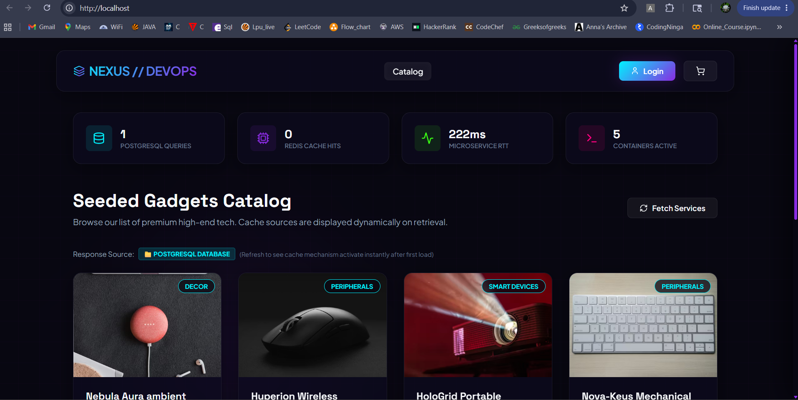

# Nexus DevOps: Containerized Multi-Service E-Commerce Platform

Welcome to **Nexus DevOps**, a professional-grade, multi-container e-commerce deployment system designed to demonstrate modern cloud engineering, microservices communication, system telemetry, and container orchestration.

This system is engineered not just as an e-commerce catalog, but as a live playground for demonstrating **high-performance caching (Redis)**, **database consistency (PostgreSQL)**, **reverse proxy load balancing (Nginx)**, **observability (Prometheus & Grafana)**, and **automation (GitHub Actions CI/CD)**.

---

## 🏗️ Architecture Design

The system runs entirely within a sandboxed Docker Bridge Network, exposing only port `80` (Nginx) to the host system as the single entry point.

```
                  ┌────────────────────────────────────────┐
                  │              Web Browser               │
                  └───────────────────┬────────────────────┘
                                      │ HTTP / Port 80
                                      v
                  ┌────────────────────────────────────────┐
                  │       Nginx Reverse Proxy Gateway      │
                  └──────────┬──────────────────┬──────────┘
                             │                  │
                    /* (Static files)  /api/* (REST Calls)
                             v                  v
        ┌────────────────────────┐  ┌────────────────────────┐
        │  React Frontend Client │  │    Express Node API    │
        └────────────────────────┘  └─────┬────────────┬─────┘
                                          │            │
                               SQL Query  │            │ Cache hit/miss
                                          v            v
                               ┌─────────────┐  ┌─────────────┐
                               │ PostgreSQL  │  │ Redis Cache │
                               └─────────────┘  └─────────────┘
```

---

## 📸 Live Visual Telemetry (Demo Screenshots)

Here are the visual demonstrations of the system in action, charting the database queries, caching latencies, and container metrics:

### 1. In-Memory Caching Response Toggles
| 📁 First Load: PostgreSQL DB Query | ⚡ Second Load: Redis Cache Hit |
| --- | --- |
|  |  |
| *Response time: ~222ms. Origin source is logged directly from the PostgreSQL database.* | *Response time drops to ~20ms (and down to <5ms). In-memory cache handles requests instantly.* |

### 2. Live System Observability Panels
#### 📈 Prometheus Query & Metrics Aggregator

*Exposes real-time request spiking rates (`http_requests_total`) compiled dynamically via the backend `/api/metrics` endpoint.*

#### 📊 Grafana Telemetry Dashboard Exploration

*Beautiful dashboard tracking HTTP status codes and route cardinalities using pre-configured database sources.*

---

## ⚡ Key DevOps Features

### 1. In-Memory Performance Caching (Redis)
*   **Mechanism**: The `GET /api/products` endpoint implements read-through caching.
*   **Flow**: Checks Redis container first (`products:all` key) -> **CACHE HIT** (returned in `<5ms`) -> If **CACHE MISS**, queries PostgreSQL, saves back to Redis with a 5-minute TTL, and returns database rows.
*   **Invalidation**: When an Admin adds a new product, the backend issues an atomic `DEL products:all` command, ensuring cache consistency.

### 2. Microservice Telemetry Panel
*   The frontend renders a live **Infrastructure Telemetry Panel** that tracks:
    *   *PostgreSQL database queries* executed during the session.
    *   *Redis cache hits* made during navigation.
    *   *Microservice round-trip times (RTT)* in milliseconds.
    *   *Active container count*.

### 3. Database Consistency & Transactions
*   The checkout endpoint runs inside a **PostgreSQL Transaction Block**.
*   Locks rows via `SELECT FOR UPDATE` to prevent race conditions during concurrent checkouts, verifying inventory availability before updating stock and creating order lines.

### 4. Reverse Proxying & Static Asset Optimization (Nginx)
*   Routes client traffic based on route prefixes (`/api/` -> Node container, other -> React container).
*   Enables dynamic **Gzip compression** to decrease page-load payload size, alongside custom HTTP cache headers for static frontend assets.

### 5. Unified System Observability (Prometheus + Grafana)
*   **Prometheus** automatically scrapes system runtime metrics (CPU, Memory, Request Rates, RTT) from the backend `/api/metrics` endpoint.
*   **Grafana** is pre-configured out-of-the-box with Prometheus as a provisioning data source, enabling instantaneous system charting.

---

## 🛠️ Step-by-Step Installation & Bootup

### Prerequisites
*   [Docker Desktop](https://www.docker.com/products/docker-desktop) installed and active.
*   `docker-compose` v2.x compatible engine.

### Quick Start
To compile and boot the entire 7-service system in the background, run the following command in the project root:

```bash
docker-compose up --build -d
```

### Verified Live Endpoints
Once the containers report healthy status, open your browser to the following local ports:

*   **🛒 E-Commerce Platform Gateway**: `http://localhost/`
*   **📈 Prometheus Scraper Status**: `http://localhost:9090/`
*   **📊 Grafana Dashboard Panel**: `http://localhost:3000/` (Sign in using `admin` / `admin`)
*   **⚙️ Core API Service Metrics**: `http://localhost/api/metrics`
*   **💓 Core API Service Health**: `http://localhost/api/health`

---

## 🧪 How to Demonstrate in Interviews

When showing this project to interviewers, walk through these interactive steps to highlight real DevOps proficiency:

1.  **Demonstrate In-Memory Caching**:
    *   Open your browser console and navigate to `http://localhost/`.
    *   Press the **Fetch Services** button. The first request will show **📁 POSTGRESQL DATABASE** with a response time of `40-100ms`.
    *   Press **Fetch Services** again. The source instantly updates to **⚡ REDIS IN-MEMORY CACHE** and the response time drops to **`<5ms`**, illustrating cache operations clearly.
2.  **Demonstrate Cache Invalidation**:
    *   Go to **Login** and create a portal account checking the **Grant Admin Privileges** option.
    *   Navigate to the **Admin Panel** and add a new product (e.g. *Quantum Drone*).
    *   Upon clicking **Publish & Invalidate Cache**, the backend performs a transactional insert and issues a Redis `DEL` cache key command.
    *   You are redirected back to the catalog, which immediately forces a **📁 POSTGRESQL DATABASE** query to load the new item, showing instant cache invalidation in action.
3.  **Show PostgreSQL Transactional Integrity**:
    *   Add items to your cart, click **Proceed to Checkout**.
    *   Navigate to **Orders History** to verify the transaction details mapped in the DB.
    *   If you log in as an administrator, you will see all system orders made across all test portal accounts.

---

## 📁 Repository Structure

```text
ecommerce-devops/
├── frontend/                 # React + Vite + TypeScript application
│   ├── src/                  # Glassmorphic views, components & utilities
│   ├── Dockerfile            # Multi-stage production build script
│   └── nginx.conf            # Internal SPA routing configuration
├── backend/                  # Express + TypeScript rest microservice
│   ├── src/                  # Express controllers, routes & connections
│   └── Dockerfile            # Production-optimized Node container build
├── nginx/                    # Master gateway proxy settings
│   ├── nginx.conf            # Main traffic routing configuration
│   └── Dockerfile            # Custom gatekeeper image build
├── database/                 # SQL schemas & seeder files
│   └── init.sql              # Seeds database with premium gadgets
├── monitoring/               # Metric aggregator systems
│   ├── prometheus.yml        # Scraper polling parameters
│   └── grafana-datasources.yml # Auto-provisioned Grafana setup
├── .github/                  # Continuous Integration automated runners
│   └── workflows/
│       └── ci-cd.yml         # Parallelized code compile checkers
├── docker-compose.yml        # Core Multi-Service orchestration master file
└── README.md                 # Project handbook
```
